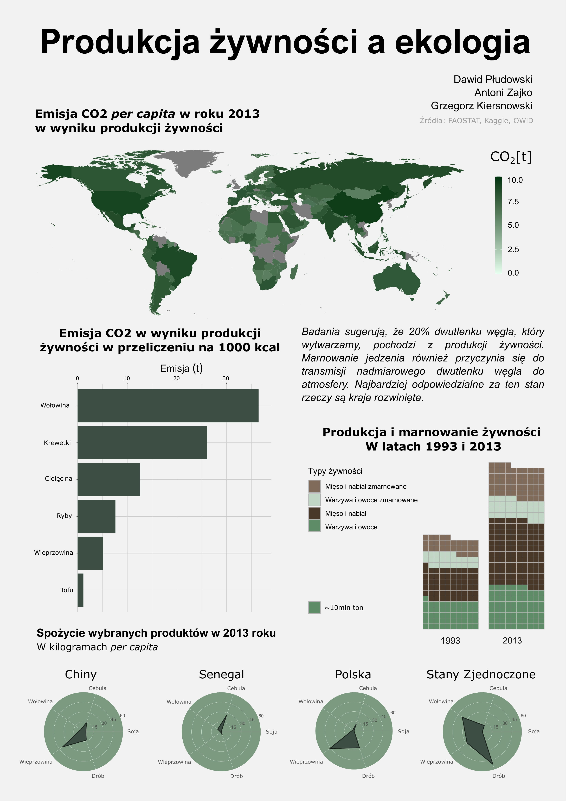

# Plakat "Produkcja żywności a ekologia"
październik 2021 - grudzień 2021

Projekt stworzony w trzyosobowym zespole.

**Z powodu nieotrzymania zgody od reszty zespołu na udostępnienie kodów źródłowych ninejszy plik zawiera jedynie galerię zdjęć oraz opis projektu.**

## Opis
Projekt został stworzony w ramach przedmiotu *techniki wizualizacji danych*. Jest to plakat ilustrujący wpływ produkcji żywności na środowisko. Zamieszczone na nim wykresy zostały wygenerowane przy pomocy bibliotek `ggplot2` i `seaborn`, po wcześniejszym preprocessingu danych w `dplyr`. 

## Moja rola
* preprocessing danych;
* utworzenie wykresów w `ggplot2`;
* obróbka graficzna przy pomocy m.in. `inkscape`;

## Galeria

Plakat

