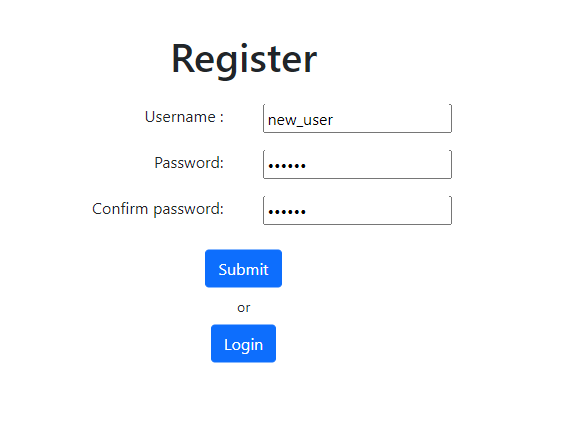

# Digit Recognizer
grudzień 2021 - styczeń 2022

Projekt stworzony w dwuosobowym zespole.
## Opis
Projekt został stworzony w ramach przedmiotu *Zaawanowane programowanie obiektowe i funkcyjne*. Jest implementacją serwisu internetowego, który pozwala użytkownikowi ręcznie narysować cyfrę, a następnie przesłać obraz do serwera, który poprzez sieć neuronową przewiduje, jaka to cyfra.

Główne funkcjonalności:
* rozpoznawanie cyfr;
* rejestracja/logowanie;
* baza danych przechowująca informacje o użytkownikach;
* wyświetlanie podstawowych statystyk użytkownika;

## Moja rola
* projekt serwisu po stronie klienta w `HTML`;
* łączenie klienta z serwerem;
* obsługa wydarzeń po stornie klienta za pomocą `thymeleaf` oraz `javascript`;

## Galeria

Okno rejestracji

Okno rysowania cyfry

Okno odpowiedzi serwera

