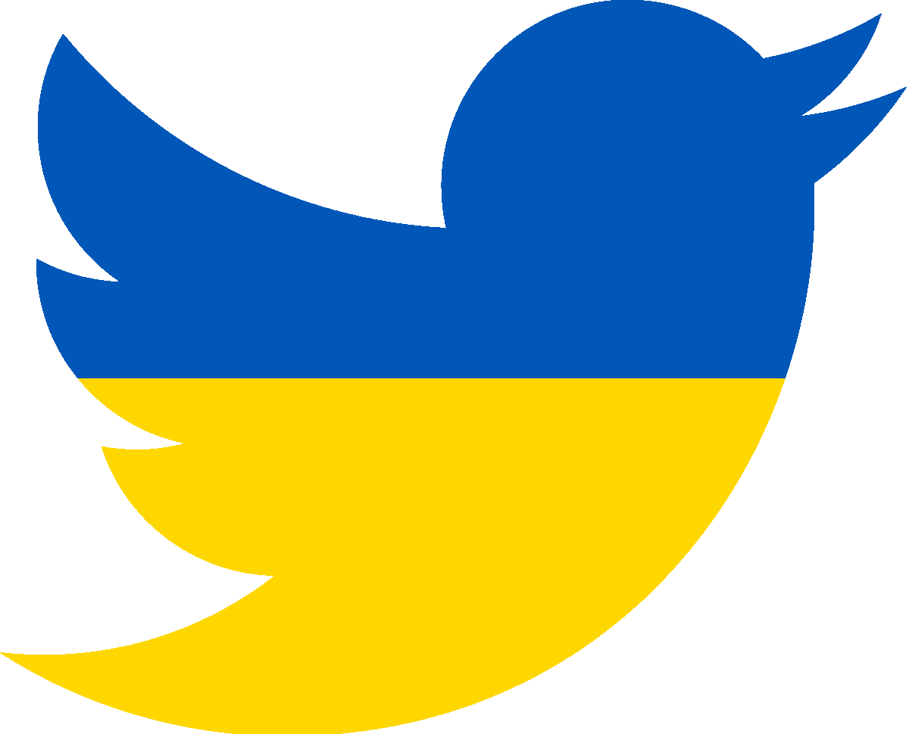
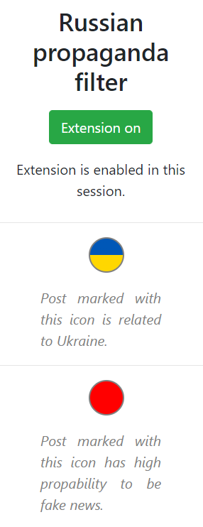
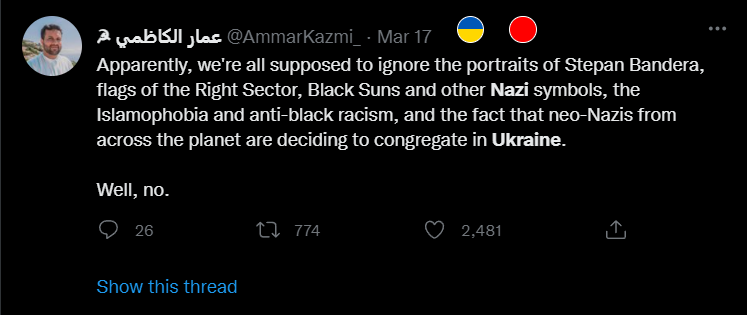
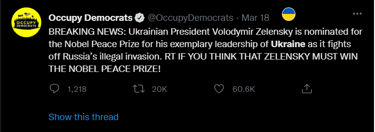

# Digit Recognizer
marzec 2022

Projekt stworzony w trzyosobowym zespole.

**Kod źródłowy jest dostępny pod poniższym linkiem:**

[Hackathon4Ukraine-team14](https://github.com/stankevichea/Hackathon4Ukraine/tree/main/team_14)

## Opis
Projekt został stworzony w ramach konkursu [Hackathon4Ukraine](https://www.facebook.com/events/1132043360669520). Jest implementacją roszerzenia do przeglądarki Chrome, które zapewnia filtrowanie tweetów z oznaczaniem tych, które dotyczą wojny na Ukrainie oraz tych, które zostały rozpoznane przez model uczenia maszynowego jako potencjalna propaganda polityczna lub dezinformacja.

Główne funkcjonalności:
* sieć neuronowa;
* baza danych przechowująca wyniki;
* prosty interfejs użytkownika;

## Moja rola
* projekt UI i UX;
* napisanie rozszerzenia do Chrome;
* labelowanie danych do uczenia modelu;

## Galeria

Prototyp logo rozszerzenia:

Popup rozszerzenia:

Przykłady oznaczonych tweetów:

