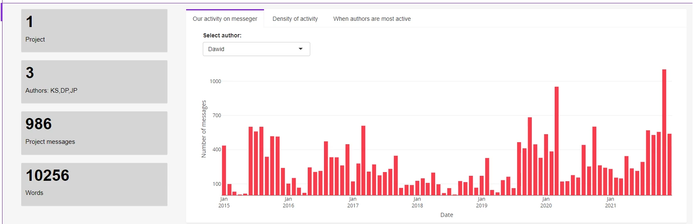
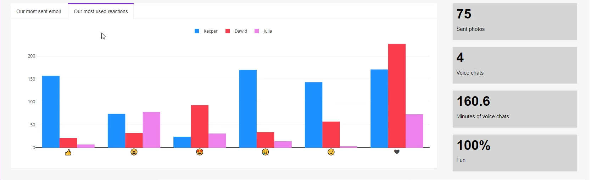
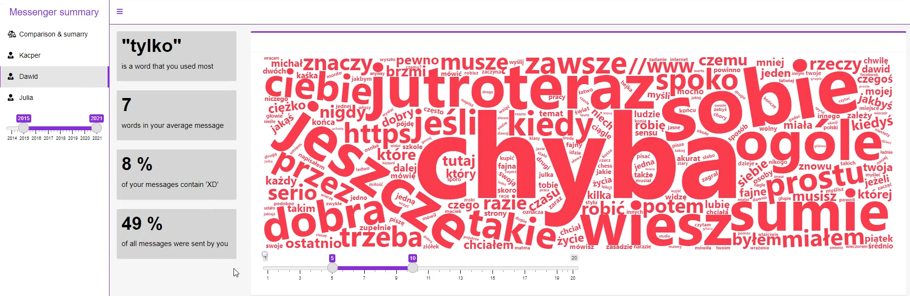
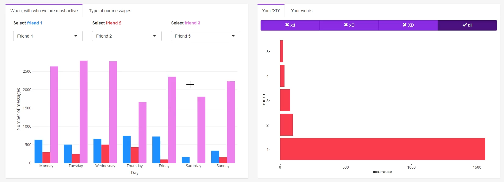

# Messenger dashboard
styczeń 2022 - luty 2022

Projekt stworzony w trzyosobowym zespole.

**Z powodu nieotrzymania zgody od reszty zespołu na udostępnienie kodów źródłowych ninejszy plik zawiera jedynie galerię zdjęć oraz opis projektu.**

## Opis
Projekt został stworzony w ramach przedmiotu *techniki wizualizacji danych*. Jest implementacją dashboardu prezentującego inforamcje o aktywności autorów w aplikacji Messenger. Na wykresach zostały przedstawione dane porównujące aktywność autorów (panel wspólny) oraz ich indywidualne podsumowania (panel indywidualny).

Główne funkcjonalności:
* interaktywność;
* porównanie aktywności trzech różnych osób;
* kompleksowa analiza aktywności użytkownika;

## Moja rola
* udział w tworzeniu UI i UX;
* wytworzenie wiekszości wykresów z panelu indywidualnego;
* preprocessing danych użytych przy generowaniu wykresów;

## Galeria

Panel wspólny:

Panel indywidualny:

